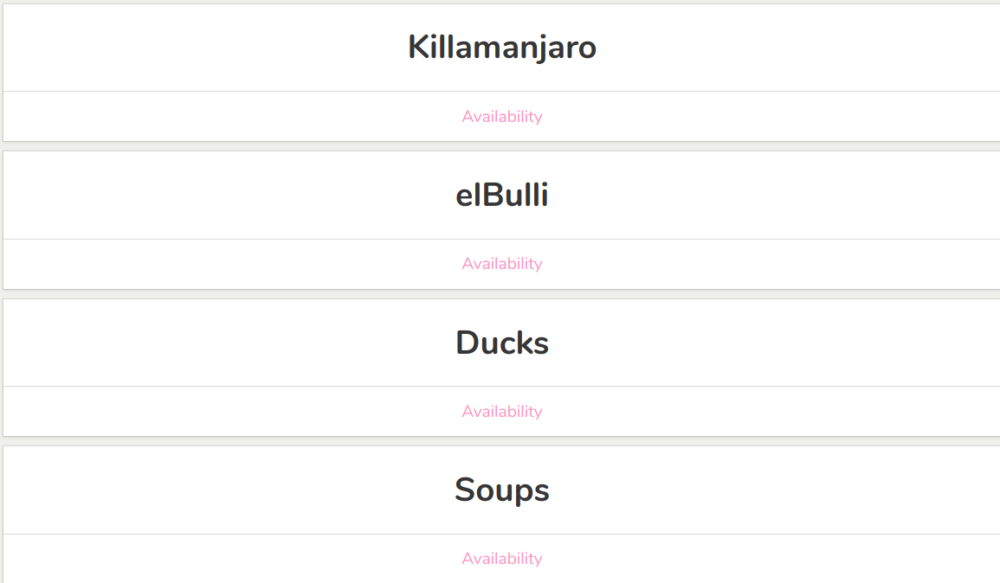
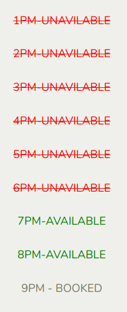

# Reservation Bot

[Live Site incoming...](#)

### Restaurant index page:

### Reservation list page:

Reservation bot is basic bot that utilizes Twillios api to make reservations.

## Technologies

* Express 
* Twilio API 
* React

## Built With

* Express to implement the backend framework
* Twilio API to implement to facilitate sending/recieving of SMS
* Coustom JSon Object to hold  for the database
* React for the Frontend
* Fetch API to access backend through Thunk actions

## Core Functionality

* SMS - Users can book a restaurants by sending an SMS msg.
* Reservations  - Users can check the availability of reservations for the day

